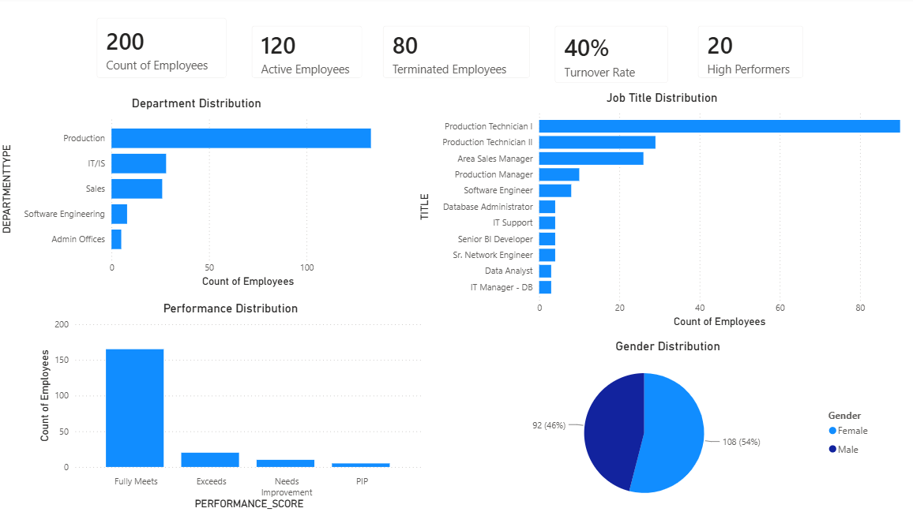

# Workforce Performance Analytics Dashboard



## Project Overview

Human Resources and operational teams require accurate workforce reporting to monitor employee headcount, turnover, workforce composition, and employee performance.

This project demonstrates how workforce data can be validated, transformed, analysed, and visualised to support performance monitoring and evidence-based decision-making.

Using Python, Snowflake, SQL, and Power BI, workforce data was assessed, processed, loaded into a Snowflake environment, analysed using SQL, and transformed into interactive dashboards to provide actionable workforce insights.

---

## Dashboard Preview

The dashboard provides an overview of workforce performance and composition, including:

* Total Employees
* Active Employees
* Terminated Employees
* Turnover Rate
* High Performers
* Department Distribution
* Job Title Distribution
* Performance Distribution
* Gender Distribution

---

## Project Architecture

```text
Raw HR Dataset
        ↓
Python Data Assessment
        ↓
Employee Population Selection
        ↓
Snowflake Data Warehouse
        ↓
SQL Analysis
        ↓
Power BI Dashboard
        ↓
Performance Reporting
```

---

## Tools & Technologies

* Python
* Pandas
* Snowflake
* SQL
* Power BI
* Excel
* CSV Data Processing

---

## Business Questions

This project was designed to answer the following business questions:

* How many employees are currently active?
* What is the employee turnover rate?
* Which departments contain the largest workforce?
* What are the most common job roles?
* How is employee performance distributed across the organisation?
* What is the workforce gender distribution?
* Which workforce segments may require management attention?

---

## Dataset

The project uses employee workforce data containing:

* Employee ID
* Employee Name
* Start Date
* Exit Date
* Job Title
* Department
* Business Unit
* Employee Status
* Gender
* Performance Score
* Employment Type

The final reporting dataset consists of a processed sample of 200 employees prepared for workforce analysis and reporting.

---

## Dashboard Metrics

| Metric               | Value |
| -------------------- | ----- |
| Total Employees      | 200   |
| Active Employees     | 120   |
| Terminated Employees | 80    |
| Turnover Rate        | 40%   |
| High Performers      | 20    |

---

## Key Insights

* The workforce dataset contains 200 employees.
* 120 employees are currently active.
* Employee turnover rate is 40%.
* Production is the largest department and represents the majority of employees.
* Production Technician roles are the most common workforce positions.
* Most employees achieved a "Fully Meets" performance rating.
* Female employees represent 54% of the workforce, while male employees represent 46%.
* Workforce reporting highlights organisational structure, performance trends, and potential areas for workforce planning.

---

## Project Components

### Data Assessment & Preparation

Python scripts were used to:

* Assess source HR datasets
* Validate employee records
* Prepare reporting populations
* Create pilot workforce datasets
* Support downstream reporting and analysis

### Snowflake Data Warehouse

Snowflake was used to:

* Create databases, schemas, and tables
* Load processed workforce datasets
* Store reporting-ready workforce data
* Support SQL-based workforce analysis

### SQL Analysis

SQL queries were developed to:

* Calculate workforce KPIs
* Analyse employee distributions
* Summarise workforce metrics
* Support dashboard reporting requirements

### Power BI Dashboard

Power BI was used to:

* Develop workforce KPI dashboards
* Build interactive visualisations
* Monitor workforce performance metrics
* Communicate insights to decision-makers

---

## Skills Demonstrated

* Data Validation & Reconciliation
* Data Quality Assessment
* Data Cleansing & Preparation
* SQL Query Development
* Snowflake Data Management
* Power BI Dashboard Development
* KPI Reporting
* Workforce Analytics
* Trend Analysis
* Performance Reporting
* Data Visualisation
* Evidence-Based Decision Making

---

## Repository Structure

```text
Workforce_Performance_Analytics_Dashboard
│
├── README.md
│
├── dashboard/
│   └── workforce_analytics_dashboard.pbix
│
├── screenshots/
│   └── workforce_analytics_dashboard.png
│
├── data/
│   ├── raw/
│   │   └── employee_data.csv
│   │
│   └── processed/
│       └── employee_master.csv
│
├── scripts/
│   ├── 01_hr_source_assessment.py
│   ├── 02_create_payroll_population.py
│   └── 03_create_pilot_group.py
│
└── sql/
    ├── 01_create_snowflake_objects.sql
    └── 02_workforce_analysis_queries.sql
```

---

## Relevance to Performance Analyst Roles

This project demonstrates practical experience in:

* Developing reporting datasets
* Maintaining data quality standards
* Analysing workforce and performance trends
* Building Power BI dashboards and visualisations
* Producing management reporting outputs
* Supporting evidence-based decision-making
* Using Snowflake and SQL for data analysis
* Communicating analytical findings through dashboards and reporting

These skills are directly relevant to Performance Analyst, Reporting Analyst, Business Intelligence Analyst, and Data Analyst roles.
