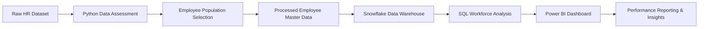

# Workforce Performance Analytics Dashboard

## Business Problem

Organisations require accurate workforce reporting to monitor employee performance, workforce composition, turnover, and operational trends. Reliable reporting enables management teams to identify workforce risks, monitor performance outcomes, and support workforce planning and decision-making.

This project demonstrates how workforce data can be validated, transformed, analysed, and visualised using Python, Snowflake, SQL, and Power BI to generate actionable performance insights.

---

## Solution Overview

An end-to-end workforce analytics solution was developed using Python, Snowflake, SQL, and Power BI.

### Project Workflow

---

## Key Findings

| Metric               | Result |
| -------------------- | ------ |
| Total Employees      | 200    |
| Active Employees     | 120    |
| Terminated Employees | 80     |
| Turnover Rate        | 40%    |
| High Performers      | 20     |
| Female Employees     | 54%    |
| Male Employees       | 46%    |

### Key Insights

* Production was the largest department and represented the largest workforce segment.
* Production Technician roles accounted for the most common job group.
* Most employees achieved a **Fully Meets** performance rating.
* High performers represented approximately 10% of the workforce.
* Workforce reporting highlighted turnover patterns and performance distributions that could support workforce planning and management decision-making.

---

## Technologies Used

* Python
* Pandas
* Snowflake
* SQL
* Power BI
* Excel

---

## Skills Demonstrated

* Data Validation & Data Quality Assessment
* Data Cleansing & Data Preparation
* SQL Query Development
* Snowflake Data Management
* Power BI Dashboard Development
* KPI Reporting
* Workforce Analytics
* Trend Analysis
* Performance Reporting
* Data Visualisation
* Decision Support Reporting

---

## Relevance to Performance Analyst Roles

This project demonstrates practical experience in developing reporting datasets, maintaining data quality standards, analysing workforce and performance trends, building Power BI dashboards, and supporting evidence-based decision-making using Snowflake and SQL.

The skills demonstrated align closely with Performance Analyst, Reporting Analyst, Business Intelligence Analyst, and Data Analyst roles.
